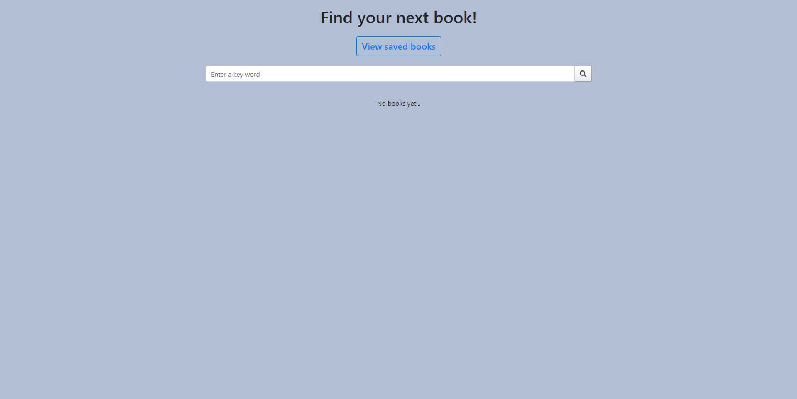
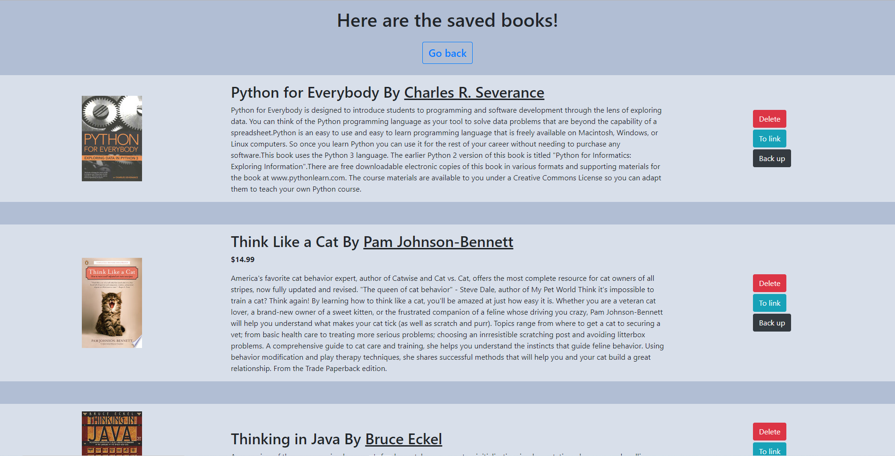

# BookFinder

## heroku link https://hidden-depths-07183.herokuapp.com/

### This website uses React, Node.js (Express), and MonogoDB.
### When a user searches a key word for a book the Google Book API is called then responding with the infomation seen on the screen.

## Home page look like this

## Saved book page lmage

